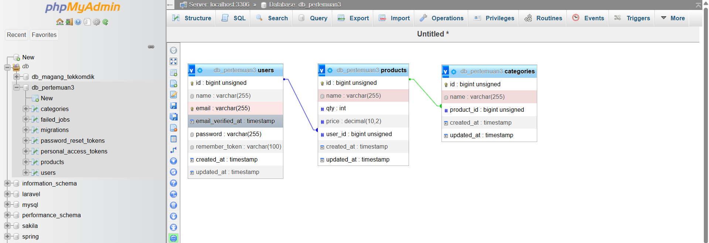
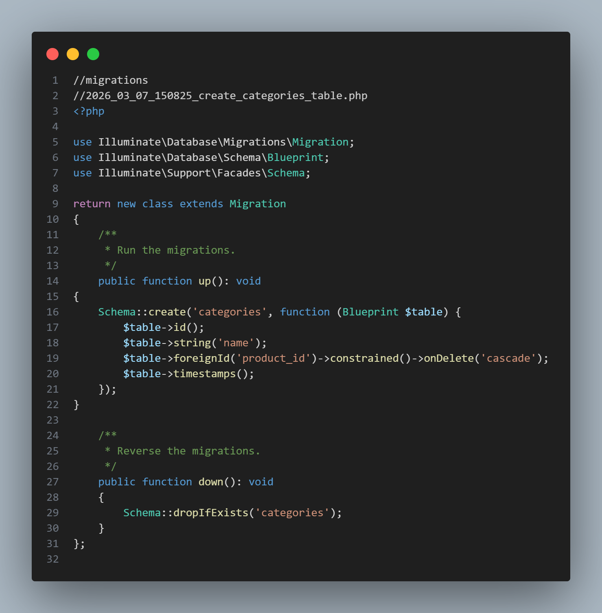
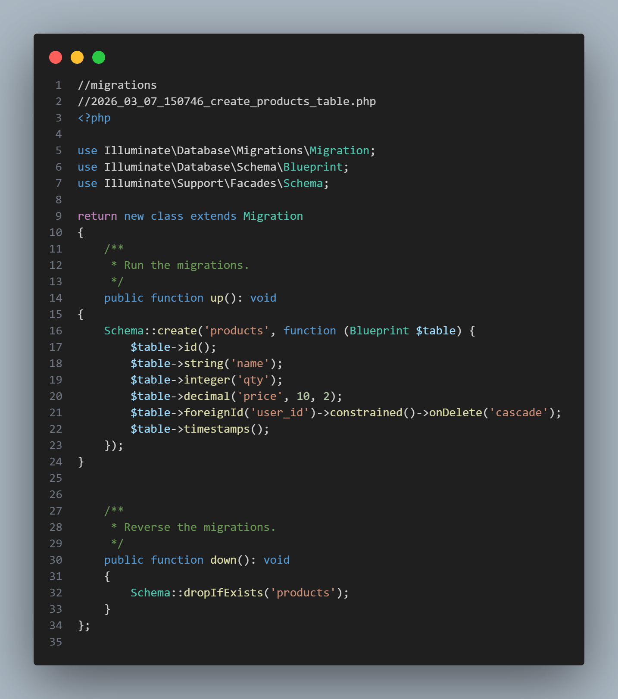
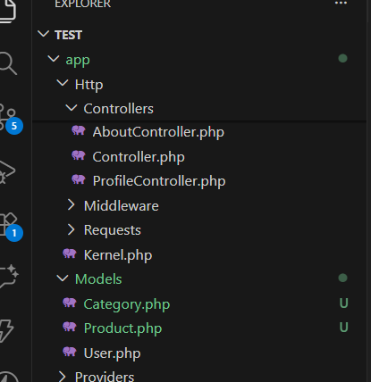

# 📦 Laravel Migration & Model Documentation

Dokumentasi implementasi **Database Structure, Migration, dan Model** pada project Laravel.

---

## 🗄️ Database Structure

<p align="center">

</p>

Relasi database terdiri dari tiga tabel utama:

| Tabel      | Keterangan                     |
| ---------- | ------------------------------ |
| users      | Menyimpan data pengguna        |
| products   | Menyimpan data produk          |
| categories | Menyimpan kategori dari produk |

---

## 🗂️ Migration Categories

<p align="center">

</p>

Migration ini digunakan untuk membuat tabel **categories** yang berelasi dengan tabel **products**.

---

## 🗂️ Migration Products

<p align="center">

</p>

Migration ini digunakan untuk membuat tabel **products** yang memiliki relasi dengan tabel **users**.

---

## 📁 Model Structure

<p align="center">

</p>

Struktur model yang digunakan dalam project Laravel:

| Model    | Fungsi                    |
| -------- | ------------------------- |
| User     | Mengelola data pengguna   |
| Product  | Mengelola data produk     |
| Category | Mengelola kategori produk |

---

## ⚙️ Menjalankan Migration

Gunakan perintah berikut untuk membuat tabel pada database:

```bash
php artisan migrate
```

Jika ingin mereset database:

```bash
php artisan migrate:fresh
```

---

## 🛠️ Tools yang Digunakan

| Tools      | Fungsi                      |
| ---------- | --------------------------- |
| Laravel    | Backend Framework           |
| MySQL      | Database                    |
| phpMyAdmin | Visualisasi relasi database |
| VS Code    | Code Editor                 |

